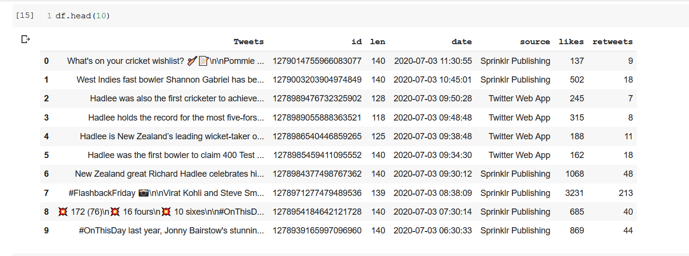

# Analyzing_Tweet_Data
Making use of the numpy and pandas modules in Python to do some very cursory analysis on the tweets that we are able to extract. 
I extracted various type of data present in a tweet such as no. of retweets, no. of likes, id, date, text of the tweet etc.

Here is a sample output of the extracted data after textual analysis :

